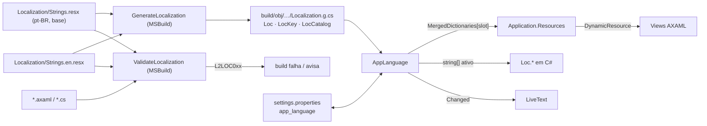
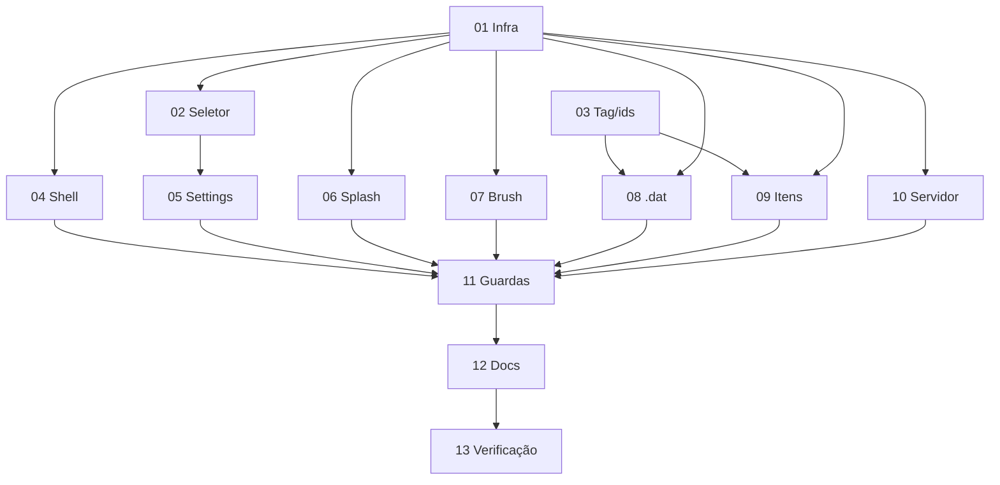

# Interface bilíngue: português (Brasil, padrão) e inglês

Tickets: `issues/01` a `issues/13` (ordem e dependências em [Tickets](#tickets)).

## Objetivo

- O app passa a ter dois idiomas de interface: `pt-BR` (padrão, o texto atual) e `en` (segunda opção).
- O usuário troca o idioma em **Configurações → Aparência → Idioma**. A troca vale na hora, sem reiniciar, e fica salva.
- Para adicionar um texto numa feature nova, basta criar uma entrada em cada catálogo. O build falha se faltar tradução, se a chave estiver errada ou se os placeholders não baterem entre os idiomas.

## Fora de escopo

- Tradução de `docs/index.html` e do `README.md`. Eles só ganham a menção à opção de idioma (ticket 12).
- Conteúdo dos server artifacts: XML, texto e GRP gerados, nomes de arquivos de saída (`Log-{name}`, `l2brush_<seed>.png`), chaves do `settings.properties`, categorias do `Presets.dat`, dados de jogo (`H5Names`, tabelas `.l2dat`, `DatEnums`).
- Mensagens técnicas de `ClientDat/`. Já estão em inglês e continuam sem tradução nos dois idiomas.
- Botões do MsBox (`Ok`) e diálogos nativos do sistema, que seguem o idioma do SO.
- Instalador: o `Setup.iss` já tem `english` e `brazilianportuguese` em `[Languages]`. Passar o idioma do instalador para o app fica como ideia futura.
- Um terceiro idioma. A arquitetura suporta, e os passos estão em [Adicionar um idioma](#adicionar-um-terceiro-idioma), mas nenhum é entregue agora.
- Comentários de código.

## Estado atual (evidência)

| Fato | Onde |
| --- | --- |
| Todo o texto da UI está hardcoded: 463 literais em atributos AXAML (`Text`, `Content`, `Watermark`, `ToolTip.Tip`, `Title`…) em 25 arquivos e pelo menos 171 literais com português em C#. A heurística deixa de fora frases sem acento, como `"Compilando..."`. | `src/Views/**`, `src/Processing/**`, `src/Utilities/**` |
| A UI já mistura idiomas: `DescriptionFix` está em inglês (`"Select file to modify descriptions"`), e também a qualidade do L2DAT Build (`Minimum`…`Maximum`) e os filtros `FilePickerFileType("All")`. | `Views/DescriptionFix.xaml.cs:46`, `Views/AppSettingsControl.axaml:362-365` |
| Publish com `PublishAot=true` e `InvariantGlobalization=true`. | `scripts/build.ps1:40-43` |
| `Properties/Resources.resx` está vazio e o `Resources.Designer.cs` não tem uso fora de si mesmo. | `src/Properties/` |
| O padrão do tema já é o modelo a seguir: `{DynamicResource Theme*}` em AXAML e `AppTheme.Brush(key)` em código, com troca ao vivo. | `Utilities/AppTheme.cs`, `Themes/Colors.axaml` |
| Os settings ficam em `%APPDATA%/L2Toolkit/settings.properties` (`Database`), com chaves em snake_case (`app_theme`). | `Settings/Database.cs` |
| Há lógica que lê o texto exibido no ComboBox. Traduzir esse texto quebraria a lógica. | `LiveData.xaml.cs:912-1008`, `SkinBuilder.xaml.cs:77-80,571-597`, `SearchIcon.xaml.cs:133-142`, `PrimeShopGenerator.xaml.cs:124-136`, `EnchantEffect.xaml.cs:492-496` |
| Exceções de `Processing/` e `Utilities/` com mensagem em português chegam à UI pelo log ou pelo status. | `Processing/Splash/{RgbaImage,SplashBmp,SplashFile}.cs`, `Processing/Brush/BrushGenerator.cs`, `Utilities/{AppUpdater,TableManager}.cs` |
| O menu de contexto do `TextBox` no Fluent usa `{DynamicResource StringTextFlyoutCutText/CopyText/PasteText}` e hoje aparece em inglês até com a UI em português. | `Avalonia.Themes.Fluent.dll` 11.2.0 (chaves encontradas no binário) |
| Não há projeto de testes. A verificação é feita na GUI. | `docs/agents/l2toolkit-engineering.md` |

## Spikes executados (2026-10-09)

| Pergunta | Resultado |
| --- | --- |
| O Avalonia 11.2 aceita chave com ponto (`{DynamicResource Settings.Theme}`) em `TextBlock.Text`, `ToolTip.Tip` e `Window.Title` com compiled bindings? | Aceita. Compila sem aviso. |
| Substituir `Application.Resources.MergedDictionaries[i]` atualiza a UI ao vivo? | Atualiza: `before=Theme title=Theme` passou a `after=Tema title=Tema`. |
| Uma task MSBuild inline (`RoslynCodeTaskFactory`) consegue ler JSON com `System.Text.Json`? | Não. Sem referência dá CS0234; com referência ao shared framework dá CS0012, porque mistura com `netstandard`. |
| A mesma task lê XML com `System.Xml.Linq` e emite diagnóstico com arquivo e linha? | Lê. Saída: `Strings.resx(3,3): warning L2LOC003: …` |

## Decisões

### D1. Catálogos em ResX, compilados por um gerador próprio

- `src/Localization/Strings.resx` é o português, idioma padrão e fonte de verdade das chaves. `src/Localization/Strings.en.resx` é o inglês. Cada entrada é `<data name="Chave"><value>Texto</value><comment>contexto opcional</comment></data>`.
- O catálogo base é o pt-BR porque é o idioma padrão e é o texto que já existe: a migração copia os literais atuais para ele, e o inglês é preenchido em seguida.
- Os dois arquivos saem do `EmbeddedResource`. Assim não há satellite assembly, `ResourceManager` nem `CultureInfo`. O gerador (D2) transforma os catálogos em C#.
- Alternativas descartadas:
  - `ResourceManager` com satélites: com `InvariantGlobalization=true`, `new CultureInfo("pt-BR")` falha [INFERENCE: comportamento do .NET 8+ com `PredefinedCulturesOnly`]. Satélites sob Native AOT acrescentam risco sem ganho.
  - JSON: a task inline não consegue usar `System.Text.Json` (ver spike).
  - Classes C# tipadas por idioma: cada string exigiria três edições, e o binding em AXAML ficaria verboso.
- Formato XML padrão, abre no editor de ResX do VS/Rider. [INFERENCE: a grade lado a lado do Rider reconhece os arquivos mesmo fora do `EmbeddedResource`; isso é conveniência, não requisito.]

### D2. Gerador e validador em MSBuild

`src/Localization/Localization.targets`, importado pelo csproj, define duas tasks inline (`RoslynCodeTaskFactory` + `System.Xml.Linq`, já provado no spike):

- `GenerateLocalization` tem como Inputs os dois `.resx` e como Output `$(IntermediateOutputPath)Localization.g.cs`. Roda antes de `CoreCompile` e inclui o arquivo gerado em `Compile` e em `FileWrites`. O arquivo vai para `build/obj/`, seguindo o `Directory.Build.props`.
- `ValidateLocalization` roda em todo build. Varre `**/*.axaml` e `**/*.cs` (exceto os gerados) e emite os [diagnósticos](#diagnósticos-do-build) com arquivo e linha.
- Não cria projeto novo nem dependência nova, e roda igual em `make run`, `dotnet build` e `make build`.

### D3. AXAML usa `DynamicResource` com a chave

`Text="{DynamicResource SplashScreen.SaveButton}"`. É o mesmo mecanismo do tema, e o spike provou a troca ao vivo. Uma chave inexistente em AXAML vira erro de build (L2LOC005).

### D4. C# usa a classe `Loc`, gerada

- Texto simples: `Loc.SplashScreen.SaveButton` (propriedade `string`).
- Com placeholders: `Loc.BrushVariants.Exported(count, folder)`. O método é gerado com os parâmetros nomeados do catálogo, então aridade e nomes são checados pelo compilador.
- Plural: `Loc.Geodata.Converted(count)` escolhe entre `.One` e `.Other` (D8).
- Chave como constante, para binding em controle criado em código: `LocKey.Common.Cancel`.
- Leitura thread-safe: os valores ficam num `string[]` imutável por idioma, trocado com `Volatile.Write`. Isso permite que `Processing/` monte mensagens em thread de background.

### D5. Troca ao vivo, com política explícita para texto dinâmico

| Tipo de texto | Mecanismo | Muda na troca? |
| --- | --- | --- |
| Rótulo estático em AXAML (inclui `ComboBoxItem`, `ToolTip.Tip`, `Window.Title`, `Watermark`) | `{DynamicResource Area.Key}` | Sim |
| Rótulo fixo em controle criado em código | `[!TextBlock.TextProperty] = AppLanguage.Bind(LocKey.Area.Key)`, análogo a `AppTheme.Brush` | Sim |
| Texto de estado que continua na tela (status de build, legenda de tile, contador, título montado) | `LiveText.Set(control, () => Loc.Area.Key(args))` | Sim |
| Texto transitório (linha de log, notificação, MessageBox, mensagem de exceção exibida) | `Loc.Area.Key(args)` no momento da emissão | Não. Fica no idioma em que foi emitido. |

Páginas em cache no `MainWindow` e janelas secundárias herdam os recursos de `Application`, então todas acompanham a troca. Isso é verificado nos tickets 02 e 13.

### D6. Persistência e idioma padrão

- A chave `app_language` guarda `pt-BR` ou `en`.
- Sem a chave (instalação nova ou usuário existente) ou com valor desconhecido: `pt-BR`. Quem já usa o app não percebe mudança até escolher English.
- Nada é gravado até o usuário trocar o idioma, e não há regra de migração.

### D7. Formatação sem `CultureInfo`

- Placeholders são nomeados no catálogo (`{count} brushes exportados em {folder}`), com formato opcional (`{count:N0}`). Chaves literais se escrevem `{{` e `}}`. O gerador converte para posições e chama `string.Format(CultureInfo.InvariantCulture, …)`.
- Números continuam como hoje, invariantes (`1,234` e `12.5 MB`), já que o app roda em `InvariantGlobalization`. Não há regressão em pt-BR.
- Datas: o formato também é texto de catálogo. `Format.DateTime` vale `dd/MM/yyyy HH:mm` em pt-BR e `yyyy-MM-dd HH:mm` em en. É usado no modal de update (`MainWindow.xaml.cs:90`).

### D8. Plural

- Usa um par de chaves irmãs `X.One` e `X.Other`, as duas com `{count}`. Isso substitui `arquivo(s)` e `convertido(s)`.
- Regra inicial nos dois idiomas: `count == 1` usa `One`. Ela fica numa função por idioma em `AppLanguage`.

### D9. A lógica nunca depende do texto exibido

- `ComboBoxItem` ganha `Tag` com o id estável, que é o valor que a lógica e o `Presets.dat` usam hoje (`Armor`, `Weapons`, `Items`, `Skills`). O código lê `Tag`, e o `Content` pode ser traduzido. Esse trabalho é o ticket 03.
- Valores que vêm de dados (grades do `.dat`, nomes de presets, categorias do Prime Shop) não são traduzidos.
- Os nomes de tipo do domínio, que hoje já aparecem em inglês na UI em português (`Skills`, `Weapons`, `Armor`, `Items`, `Normal (00000000)`), continuam literais nos dois idiomas e entram em `NonTranslatable.txt`. O `Tag` garante que, se um dia forem traduzidos, o comportamento não muda.

### D10. Seletor de idioma

ComboBox em Configurações → Aparência, logo abaixo de Tema. Os itens são endônimos, iguais nos dois idiomas e nesta ordem: `Português (Brasil)` (padrão) e `English`. Cada item tem `Tag` `pt-BR` / `en`.

### D11. Origem dos textos

- pt-BR migra literalmente: o valor no catálogo é igual ao literal atual, sem reescrita, para evitar regressão.
- O inglês é texto novo, escrito seguindo o [glossário](#glossário-de-tradução).
- As telas que hoje estão só em inglês ganham pt-BR novo.

## Arquitetura



### Arquivos

| Arquivo | Papel |
| --- | --- |
| `src/Localization/Strings.resx` | Catálogo pt-BR (padrão), fonte de verdade das chaves |
| `src/Localization/Strings.en.resx` | Catálogo en, com as mesmas chaves |
| `src/Localization/NonTranslatable.txt` | Literais permitidos em AXAML/C# sem catálogo (`L2 Toolkit`, `5000 px`, `Lineage2Ver121`, `L2J (.l2j)`, `Português (Brasil)`, `English`…), um por linha |
| `src/Localization/Localization.targets` | Tasks `GenerateLocalization` e `ValidateLocalization` |
| `src/Localization/AppLanguage.cs` | Idioma ativo, persistência, aplicação no `Application`, `Bind`, `Changed` e acesso interno do código gerado |
| `src/Localization/LiveText.cs` | Texto de estado que se reavalia na troca de idioma |
| `src/L2Toolkit.csproj` | `<EmbeddedResource Remove="Localization\Strings*.resx" />`, os itens `L2LocCatalog` e o `<Import>` do targets |
| `src/App.axaml.cs` | `AppLanguage.ApplySaved()` logo depois de `AppTheme.ApplySaved()` |

A pasta `Localization/` vira o namespace `L2Toolkit.Localization`, mantendo a regra pasta = namespace.

### Formato do catálogo

```xml
<!-- Strings.resx (pt-BR) -->
<data name="BrushVariants.Exported" xml:space="preserve">
  <value>{count} brushes exportados em {folder}.</value>
  <comment>Status depois de "Exportar todos…"; folder é um caminho absoluto.</comment>
</data>
<data name="Geodata.Converted.One" xml:space="preserve"><value>{count} convertido</value></data>
<data name="Geodata.Converted.Other" xml:space="preserve"><value>{count} convertidos</value></data>
<data name="StringTextFlyoutCutText" xml:space="preserve"><value>Recortar</value></data>
```

Chaves `String*` sem ponto são overrides de recursos do Fluent. Elas vão para o dicionário, mas não para `Loc`.

### Código gerado (forma)

```csharp
namespace L2Toolkit.Localization;

public static class Loc
{
    public static class BrushVariants
    {
        public static string Exported(object count, object folder) => AppLanguage.Format(41, count, folder);
    }
    public static class Geodata
    {
        public static string Converted(int count) => AppLanguage.Plural(57, 58, count);
    }
    public static class Common
    {
        public static string Cancel => AppLanguage.Text(3);
    }
}

public static class LocKey
{
    public static class Common { public const string Cancel = "Common.Cancel"; }
}

internal static class LocCatalog
{
    internal static readonly string[] Keys = [/* … */];
    internal static readonly string[] PtBr = [/* "{0} brushes exportados em {1}." … */];
    internal static readonly string[] En = [/* … */];
}
```

- A ordem dos parâmetros segue a primeira aparição no valor em pt-BR (catálogo base). Em en o gerador remapeia por nome, então a frase traduzida pode mudar a ordem.
- Nos métodos de plural, `int count` vem primeiro e os demais placeholders depois.

### API de runtime

```csharp
public enum UiLanguage { PtBr, En }            // tags "pt-BR" / "en"; PtBr é o padrão

public static class AppLanguage
{
    public static UiLanguage Current { get; }
    public static UiLanguage Saved { get; }     // app_language; ausente ou inválido = PtBr (D6)
    public static event Action? Changed;        // disparado na UI thread, depois da troca
    public static void ApplySaved();
    public static void Set(UiLanguage language); // aplica + persiste
    public static IBinding Bind(string key);     // new DynamicResourceExtension(key)
    internal static string Text(int index);
    internal static string Format(int index, params object?[] args);
    internal static string Plural(int one, int other, int count, params object?[] args);
}

public static class LiveText
{
    public static void Set(TextBlock target, Func<string> text);
    public static void Set(AvaloniaObject target, AvaloniaProperty<string?> property, Func<string> text);
    public static void Clear(AvaloniaObject target);
}
```

- Aplicar um idioma monta um `ResourceDictionary` com as chaves sem placeholder e os overrides `String*`. Depois substitui um único slot fixo de `Application.Current.Resources.MergedDictionaries`, o que gera uma só notificação.
- `LiveText` guarda os alvos em `ConditionalWeakTable` e numa lista de `WeakReference`, então não segura páginas nem janelas fechadas. Num controle registrado, toda escrita passa por `LiveText.Set` ou `Clear`. Uma atribuição direta seria sobrescrita na próxima troca.

### Diagnósticos do build

| Código | Nível | Condição |
| --- | --- | --- |
| L2LOC001 | erro | Chave presente num catálogo e ausente no outro |
| L2LOC002 | erro | Conjunto de placeholders diferente entre pt-BR e en, ou placeholder malformado |
| L2LOC003 | erro | Chave inválida: fora de `^[A-Z][A-Za-z0-9]*(\.[A-Z][A-Za-z0-9]*)+$` (exceto `String*`), duplicada, ou folha que também é prefixo de outra chave |
| L2LOC004 | erro | Valor vazio |
| L2LOC005 | erro | AXAML referencia uma chave com ponto que não existe, ou uma chave com placeholder ou plural |
| L2LOC006 | erro | Plural incompleto (`.One` sem `.Other` ou o contrário), ou sem `{count}` |
| L2LOC007 | aviso; vira erro no ticket 11 | Literal com letras em AXAML, fora de `NonTranslatable.txt`. Vale para os atributos `Text`, `Content`, `Header`, `Watermark`, `ToolTip.Tip` e `Title` e para o texto direto de elemento (`<ComboBoxItem>Skills</ComboBoxItem>`, `<Run>…</Run>`, `<TextBlock>…</TextBlock>`). |
| L2LOC008 | aviso; vira erro no ticket 11 | Literal com letras em C#, em `Views/`, `Processing/` ou `Utilities/`, passado a `.Text =`, `.Title =`, `.Content =`, `.Watermark =`, `Title =` em inicializador, `AddLog(`, `GetMessageBoxStandard(`, `new FilePickerFileType(`, `PickOpenAsync(`, `PickSaveAsync(`, `SendNotify(`, `ShowNotification(` ou `throw new …Exception(`. Fica de fora se estiver em `NonTranslatable.txt` ou se a linha terminar com `// loc-ok`. |
| L2LOC009 | aviso | Chave que não aparece em nenhum AXAML (`DynamicResource`) nem em C# (`Loc.`/`LocKey.`) |

Os avisos L2LOC007/008 dão o inventário exato do que falta migrar. Os tickets 04 a 10 levam esses avisos a zero.

## Convenção de chaves

- O formato é `Área.Elemento[.Qualificador]`, com segmentos em PascalCase e pelo menos dois segmentos. O último segmento diz o papel: `…Button`, `…Label`, `…Title`, `…Hint`, `…Tip`, `…Watermark`, `…Status`, `…Error`, `…Log`, `…Picker` (título de diálogo de arquivo), `…Filter` (nome de `FilePickerFileType`).
- A área é o nome da View sem o sufixo técnico:

| Área | Origem |
| --- | --- |
| `Common` | Textos realmente genéricos: Cancel, Close, Copy, Save, Browse, Error, Loading, Done, filtros “All files” |
| `Nav` | Nomes das ferramentas: sidebar e chips de Settings |
| `Main` | Titlebar e shell do `MainWindow` |
| `Update` | Modal de atualização, `AppUpdater` |
| `Settings` | `AppSettingsControl` |
| `Format` | Padrões de data |
| Nome da View | `SplashScreen`, `SplashLibrary`, `SplashCompose`, `BrushGenerator`, `BrushVariants`, `SystemMsgColor`, `EnchantEffect`, `LiveData`, `SkinBuilder`, `CreateMultisell`, `PrimeShop`, `SearchIcon`, `DoorGenerate`, `Geodata`, `PawnData`, `SpawnManager`, `Missions`, `UpgradeNormal`, `DescriptionFix`, `LogParse` |
| `Splash`, `Brush`, `Tables` | Mensagens de `Processing/Splash`, `Processing/Brush` e `TableManager` |

- Só `Common.*` e `Nav.*` são reutilizados entre áreas. Uma chave de outra área não é reaproveitada só porque o texto coincide, porque o contexto pode divergir na tradução.
- Placeholders em camelCase com nome semântico (`{count}`, `{fileName}`, `{folder}`, `{message}`), nunca `{0}`.

## Glossário de tradução

Ficam iguais nos dois idiomas: Multisell/MultiSell, Prime Shop, Skin Builder, Enchant Effect, System Msg, Splash Screen, Live Data (166), Geodata, Spawn, PawnData, Upgrade Normal System, L2DAT, client `.dat`, Name table, brush, preset, release, GitHub, SysTextures, nomes de arquivo, formatos e versões de envelope.

| pt-BR | en |
| --- | --- |
| Configurações / Aparência / Aplicativo | Settings / Appearance / Application |
| Idioma / Tema / Escuro (padrão) / Claro | Language / Theme / Dark (default) / Light |
| FERRAMENTAS / UTILITÁRIOS | TOOLS / UTILITIES |
| Gerar Portas / Converter Geodata / Animações (PawnData) | Door Generator / Geodata Converter / Animations (PawnData) |
| Corrigir Descrição / Missões Diárias / Modo Live Data (166) | Description Fix / Daily Missions / Live Data Mode (166) |
| Criar MultiSell / Gerador de Brush / Pesquisar Ícone / Gerenciar Logs | Create MultiSell / Brush Generator / Icon Search / Log Manager |
| Pasta / Arquivo / Pasta do client | Folder / File / Client folder |
| Selecionar (botão de picker) / Selecione o arquivo (título) | Browse… / Select a file |
| Gerar / Carregar / Salvar / Exportar / Copiar / Copiado! | Generate / Load / Save / Export / Copy / Copied! |
| Processando… / Pronto / Erro / Cancelar / Fechar | Processing… / Done / Error / Cancel / Close |
| Nova versão disponível / Agora não / Atualizar agora / Verificar atualizações | New version available / Not now / Update now / Check for updates |
| Publicada em / Novidades / Sem notas para esta versão. | Published / What's new / No notes for this release. |
| cor-chave / Contorno / Sombra projetada / Borda suave | key color / Stroke / Drop shadow / Soft edge |
| Pontas / Rachaduras / Garras / Estilhaços / Simetria / Semente / Desfoque | Spikes / Cracks / Claws / Shards / Symmetry / Seed / Blur |
| Fora / Dentro / Centro | Outside / Inside / Center |
| Trocar todos por imagem… / Trocado · não salvo / Descartar / Salvar todos | Replace all with image… / Swapped · unsaved / Discard / Save all |
| Gerar vários… / Exportar todos… / Compor com brush… | Generate many… / Export all… / Compose with brush… |
| Recortar / Copiar / Colar (menu do TextBox) | Cut / Copy / Paste |

Estilo:

- en usa sentence case em botões e rótulos (`Check for updates`).
- Títulos de seção ficam em maiúsculas nos dois idiomas, como hoje (`TOOLS`, `PROGRESS`).
- `…` marca ação que abre diálogo ou janela.
- Rótulos e botões não levam ponto final. Frases de status e erro levam.

## Fluxo para uma feature nova

1. Escolha a área e o nome da chave pela [convenção](#convenção-de-chaves).
2. Adicione o `<data>` em `Strings.resx`, em português. Use `<comment>` se o texto for ambíguo ou tiver placeholder.
3. Adicione a mesma chave em `Strings.en.resx`, em inglês.
4. Use a chave:
   - AXAML: `{DynamicResource Área.Chave}`.
   - C#: `Loc.Área.Chave` ou `Loc.Área.Chave(args)`.
   - Texto de estado: `LiveText.Set(...)`.
   - Controle criado em código: `AppLanguage.Bind(LocKey.Área.Chave)`.
   - Valor de ComboBox: `Tag` com o id e `Content` traduzido.
5. Rode `make run`. Os erros L2LOC apontam arquivo e linha do que falta.
6. Troque o idioma em Configurações → Aparência → Idioma com a tela aberta. Confira que nada fica no idioma antigo e que nada corta.

### Adicionar um terceiro idioma

1. Crie `Strings.<tag>.resx` com todas as chaves. O L2LOC001 lista as que faltam.
2. Adicione um item `L2LocCatalog` no csproj (`Language="<tag>"`).
3. Adicione o valor em `UiLanguage`, a tag e a regra de plural em `AppLanguage`, e o endônimo no seletor e em `NonTranslatable.txt`.

## Inventário (heurística, para dimensionar)

| Ticket | Arquivos | Literais AXAML | Literais C# com PT (mín.) |
| --- | --- | ---: | ---: |
| 04 Shell | `MainWindow.axaml/.xaml.cs`, `Utilities/AppUpdater.cs` | 35 | 7 |
| 05 Settings | `AppSettingsControl.axaml/.xaml.cs` | 41 | 13 |
| 06 Splash | `SplashScreen`, `SplashLibraryWindow`, `SplashComposeWindow`, `Processing/Splash/*` | 76 | 37 |
| 07 Brush | `BrushGeneratorPage`, `BrushVariantsWindow`, `Processing/Brush/BrushGenerator.cs` | 29 | 7 |
| 08 Editores `.dat` | `SystemMsgColor`, `EnchantEffect` | 48 | 19 |
| 09 Dados de item | `LiveData`, `SkinBuilder`, `CreateMultisell`, `PrimeShopGenerator`, `SearchIcon`, `Utilities/{TableManager,Parser}.cs` | 119 | 40 |
| 10 Ferramentas de servidor | `DoorGenerateControl`, `GeodataConverterControl` + `Processing/Geodata/*`, `PawnDataControl`, `SpawnManager`, `Missions`, `UpgradeNormalSystem`, `DescriptionFix`, `LogParse` | 115 | 48 |
| **Total** | | **463** | **171** |

- Os literais AXAML incluem não traduzíveis, como `5000 px`, `Lineage2Ver121` e os nomes de animação do PawnData (`1 — Walk`). Esses vão para `NonTranslatable.txt`.
- A coluna de C# é um piso. O número exato vem dos avisos L2LOC007/008 depois do ticket 01.

## Riscos

| Risco | Mitigação |
| --- | --- |
| Lógica ou presets quebram ao traduzir rótulos | Ticket 03 antes das telas afetadas, com `Tag` como id. Nenhum diagnóstico detecta `switch` sobre `Content`, por isso o ticket 03 lista cada ponto. As demais telas leem `SelectedIndex` (Geodata, Splash, Brush, Settings) e não são afetadas. |
| Texto montado em código fica no idioma antigo depois da troca | Política D5: `LiveText` para estado. O aceite de cada ticket inclui trocar o idioma com a página carregada. |
| Overflow ou corte de layout no idioma novo | Cada tela é conferida nos dois idiomas. Larguras fixas de rótulos são revistas por ticket. |
| `Loc.*` desatualizado no IDE até o próximo build | O target roda antes de `CoreCompile`. Confirmar no ticket 01 se o design-time build do IDE pega a chave nova. [INFERENCE] |
| Build mais lento | Geração incremental (Inputs/Outputs). A validação é uma varredura de texto de ~100 arquivos. |
| Mensagem montada em background durante a troca sai misturada | Aceito: é texto transitório. A leitura é atômica por array, sem crash. |
| Inglês fica para trás numa feature nova | L2LOC001 quebra o build se a chave falta em `Strings.en.resx`. |
| Tradução inglesa com termo inconsistente | Glossário e revisão humana no ticket 13. |

## Verificação

- Build: zero erros L2LOC durante toda a migração. Depois do ticket 11, zero avisos L2LOC.
- GUI (`make run`): cada página e janela secundária em en e em pt-BR, no tema Dark, sem corte nem texto no idioma errado. Light uma vez, como smoke.
- Troca ao vivo:
  - Com uma página com arquivo carregado e status visível, trocar o idioma em Configurações e voltar. Rótulos e textos de estado mudam e o log antigo continua.
  - Janelas secundárias abertas (`SplashLibraryWindow`, `SplashComposeWindow`, `BrushVariantsWindow`) mudam junto.
- Persistência: reiniciar mantém o idioma. Sem `app_language` (perfil novo ou antigo), o app abre em pt-BR e não grava nada até a primeira troca.
- Native AOT: `make build` sem avisos novos. O executável publicado troca de idioma e persiste.
- Um fluxo de processamento real por ferramenta, em en, com saída idêntica à de pt-BR. Server artifacts não dependem do idioma.

## Tickets

| # | Ticket | Bloqueado por |
| --- | --- | --- |
| 01 | Infraestrutura de localização | — |
| 02 | Seletor de idioma e persistência | 01 |
| 03 | Desacoplar lógica dos rótulos exibidos | — |
| 04 | Shell: `MainWindow` e modal de update | 01 |
| 05 | Página Settings | 01, 02 |
| 06 | Splash Screen e janelas | 01 |
| 07 | Gerador de Brush e variações | 01 |
| 08 | Editores de client `.dat` | 01, 03 |
| 09 | Ferramentas de dados de item | 01, 03 |
| 10 | Ferramentas de servidor (XML, geodata, logs) | 01 |
| 11 | Endurecer guardas do build | 04–10 |
| 12 | Documentação | 11 |
| 13 | Verificação final e revisão de tradução | 11, 12 |



Os tickets 04 a 10 tocam arquivos disjuntos e podem correr em paralelo. Todos editam os dois `.resx`, e cada um adiciona só chaves da própria área. Conflitos de merge ficam restritos a inserções.
